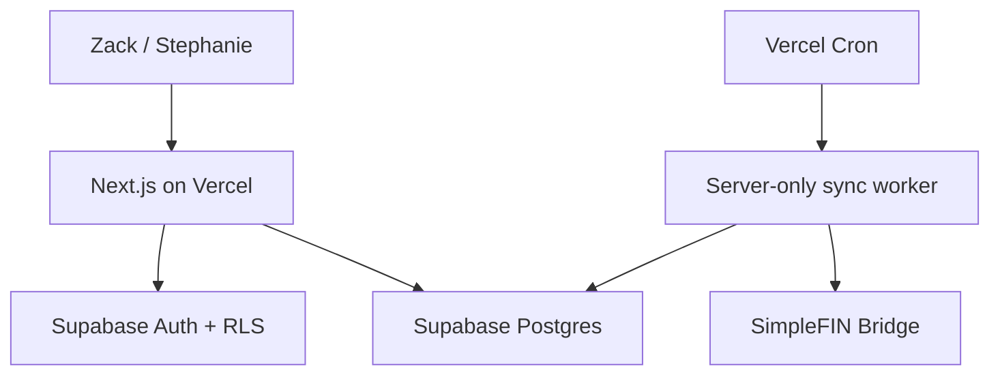

# SPND — Technical Architecture

## Chosen architecture



## Why this stack

| Layer | Choice | Reason |
|---|---|---|
| Web app | Next.js on Vercel | Familiar, fast mobile web UI and secure server routes. |
| Database/Auth | Supabase | Postgres, authentication, Row Level Security, and manageable operations. |
| Account data | SimpleFIN Bridge | Affordable read-only household transaction feed. |
| Background sync | Vercel Cron | Daily polling fits SimpleFIN's intended refresh cadence. |
| UI | Tailwind + shadcn/ui + Lucide | Fast, accessible primitives; fully customizable visual system. |

## Security boundary

The browser may send a one-time SimpleFIN Setup Token to a protected server route. The server claims it and stores the returned access URL encrypted. The browser must never receive, store, print, or log the access URL.

Use an authenticated encryption scheme such as AES-256-GCM. Keep the encryption key only in Vercel environment variables. Store the ciphertext, IV, and auth tag; never store a plaintext access URL in the database.

## Environment variables

```bash
NEXT_PUBLIC_SUPABASE_URL=
NEXT_PUBLIC_SUPABASE_ANON_KEY=
SUPABASE_SERVICE_ROLE_KEY=
SPND_ENCRYPTION_KEY_BASE64=
CRON_SECRET=
SENTRY_DSN=
```

`SPND_ENCRYPTION_KEY_BASE64` must be a 32-byte random key encoded as base64. Do not commit `.env.local`.

## Scheduled sync

- Run once daily initially; avoid needless polling.
- Authenticate the cron endpoint with `CRON_SECRET`.
- Sync each active connection independently.
- Record start/end timestamps, counts, and sanitized error messages.
- Use transaction provider IDs when present; otherwise construct a stable source fingerprint.
- Do not delete historical transactions simply because a provider response is incomplete.

## Availability and recovery

- The app should still show last-known data when SimpleFIN is temporarily unavailable.
- A user can manually request a sync only with rate-limit protection.
- Provide CSV export of transactions, budgets, and categories.
- Connection errors should identify the affected institution/account without exposing credential material.
